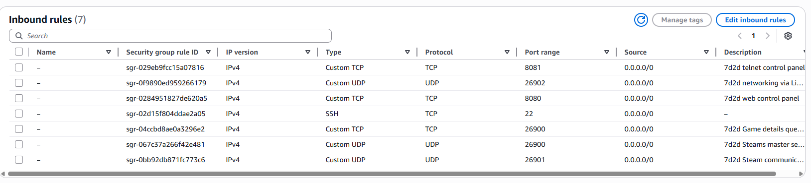

# Setting up a 7D2D server on AWS EC2

This guide will walk you through the steps to set up a 7 Days to Die (7D2D) dedicated server on an Amazon Web Services (AWS) Elastic Compute Cloud (EC2) instance. By following these instructions, you can create your own 7D2D server and invite your friends to join you in the game.

# Overview of the steps:
1. Create an EC2 instance
2. Connect to your EC2 instance
3. Install necessary dependencies
4. Download the 7D2D dedicated server
5. Configure the server
6. Start the server
7. Verify the server is running
8. Connect to your server via local Telnet
9. Further configuration (for secure access and web dashboard)
10. Automate server startup

# 1. Create an EC2 instance

- Go to the EC2 Dashboard and click "Launch Instance".
- Choose an Ubuntu image
- Choose the `c3.large` instance type with approximately 25GB of storage (7d2d dedicated server requires at least 16GB according to Steam page)
- Create a new key pair (e.g. `7D2Dkeypair`) to access your instance via SSH. Download the `7D2Dkeypair.pem` file and keep it safe.
- Configure the security group to allow necessary ports for the 7D2D server. You will need to allow both TCP and UDP traffic on the following ports (taken from https://7dtd.illy.bz/wiki/Ports):

- Add an elastic IP to your instance to have a static public IP address that you can use to connect to your server.

# 2. Connect to your EC2 instance
- Use the key pair you created or selected earlier to connect to your instance via SSH. For example:
``` bash
ssh -i "7D2Dkeypair.pem" ubuntu@your-public-ip-address
```

# 3. Install necessary dependencies
- Following the official documentation, you will also need to install SteamCMD to download the 7D2D server files. You can find instructions for installing SteamCMD here:
https://developer.valvesoftware.com/wiki/SteamCMD
``` bash
sudo add-apt-repository multiverse; sudo dpkg --add-architecture i386; sudo apt update
sudo apt install steamcmd
```

# 4. Download the 7D2D dedicated server
- Use SteamCMD to download the 7D2D server files. The app ID for the 7D2D dedicated server is 294420. It is freely available. You can use the following commands in SteamCMD:
``` bash
$>steamcmd

STEAM>force_install_dir /home/ubuntu//7days
STEAM>login anonymous
STEAM>app_update 294420
STEAM>quit
``` 

# 5. Configure the server
- Navigate to the server files and edit the `serverconfig.xml` file to configure your server settings such as server name, password, and other options. You can find more information about the available configuration options [here](https://developer.valvesoftware.com/wiki/7_Days_to_Die_Dedicated_Server).
- Make sure to set the correct ports in the configuration file that match the ports you opened in the security group.
- For example, you can set the following options in the `serverconfig.xml` file:
``` xml
<property name="ServerPort" value="26900" />
<property name="ServerName" value="My 7D2D Server" />
<property name="ServerPassword" value="yourpassword" />
```
- copy the `serverconfig.xml` to your local machine and edit it there, then copy it back to the server using `scp` or a similar tool. For example:
``` bash
scp -i "7D2Dkeypair.pem" ubuntu@your-public-ip-address:/home/ubuntu/7days/serverconfig.xml .
```
- edit the file on your local machine and then copy it back to the server:
``` bash
scp -i "7D2Dkeypair.pem" serverconfig.xml ubuntu@your-public-ip-address:/home/ubuntu/7days/serverconfig.xml
```
- edit the serveradmin.xml file to set up admin accounts and permissions if you want to use the admin features of the server. 
``` bash
scp -i "7D2Dkeypair.pem" ubuntu@your-public-ip-address:/home/ubuntu/.local/share/7DaysToDie/Saves/serveradmin.xml .
```
- Add your steam64 ID to the file and set the appropriate permissions ("0" = superadmin, "1" = admin, "2" = moderator). For example:
``` xml
<user platform="Steam" userid="YourSteam64ID" name="Tom" permission_level="0" />
```
- edit the file on your local machine and then copy it back to the server:
``` bash
scp -i "7D2Dkeypair.pem" serveradmin.xml ubuntu@your-public-ip-address:/home/ubuntu/.local/share/7DaysToDie/Saves/serveradmin.xml
```

# 6. Start the server
- Once you have configured your server, you can start it by running the `startserver.sh` script in the server files directory. You can use the following command:
``` bash
cd 7days
./startserver.sh -configfile=serverconfig.xml
```

# 7. Verify the server is running
- You can check if the server is running and listening on the correct ports by using the following command:
``` bash
sudo lsof -i -P -n | grep LISTEN

7DaysToDi 16462          ubuntu   25u  IPv4  66587      0t0  TCP *:8081 (LISTEN)
7DaysToDi 16462          ubuntu   36u  IPv4  66445      0t0  TCP *:26900 (LISTEN)
7DaysToDi 16462          ubuntu   59u  IPv4  66452      0t0  TCP 127.0.0.1:41193 (LISTEN)
7DaysToDi 16462          ubuntu   79u  IPv4  66474      0t0  TCP *:8080 (LISTEN)
7DaysToDi 16462          ubuntu   80u  IPv6  66475      0t0  TCP *:8080 (LISTEN)
``` 
- You should see the 7D2D server listening on the ports you configured in the security group.

# 8. Connect to your server via local Telnet
- You can connect to your server using a Telnet client to verify that it is running and accepting connections. Use the following command:
``` bash
telnet localhost 8081
```
- If the connection is successful, you should see a welcome message from the server. You can also use Telnet to send commands to the server and manage it remotely.

# 9. Further configuration (for secure access and web dashboard)
- disable telnet access from outside by removing the security group rule for port 8081 and only allowing it from the local machine. You can then use SSH port forwarding to access the telnet interface securely from your local machine. For example:
``` bash
ssh -i "7D2Dkeypair.pem" -L 8081:localhost:8081 ubuntu@your-public-ip-address
```
- start a game with the steam user id which has admin permissions in the serveradmin.xml file, and then use the in-game console to connect to the server. You can open the in-game console by pressing the F1 key while in the game
- create a web dashboard user by giving the command "createwebuser" in the console, and follow the provided link with a token to set up a username and password for the web dashboard user
- The web dashboard is accessible at `http://your-public-ip-address:8080`. You can log in with the username and password you set up for the web dashboard user.
- You can also set up a reverse proxy to access the web dashboard securely from outside. For example, you can use Nginx as a reverse proxy to forward requests from a domain or subdomain to the web dashboard running on port 8080. Make sure to configure the reverse proxy to use HTTPS for secure access.
- or again you can use SSH port forwarding to access the web dashboard securely from your local machine. For example:
``` bash
ssh -i "7D2Dkeypair.pem" -L 8080:localhost:8080 ubuntu@your-public-ip-address
```
- point your web browser to `http://localhost:8080` to access the web dashboard securely through the SSH tunnel.
- remove the security group rule for port 8080 to prevent direct access to the web dashboard from outside, and only allow access through the reverse proxy or SSH tunnel.

# 10. Automate server startup
- You can create a systemd service to automatically start the 7D2D server when the EC2 instance boots up. Create a new service file using the following command:
``` bash
sudo nano /etc/systemd/system/7d2d.service
```
- Add the following content to the service file:
``` ini
[Unit]
Description=7 Days to Die Server
After=network.target

[Service]
User=ubuntu
WorkingDirectory=/home/ubuntu/7days
ExecStart=/home/ubuntu/7days/startserver.sh -configfile=serverconfig.xml
Restart=on-failure

[Install]
WantedBy=multi-user.target
```
- Save the file and exit the editor. Then, enable and start the service using the following commands:
``` bash
sudo systemctl enable 7d2d.service
sudo systemctl start 7d2d.service
```
- You can check the status of the service using:
``` bash
sudo systemctl status 7d2d.service
```
- This will ensure that your 7D2D server starts automatically whenever the EC2 instance is rebooted or started.

# Conclusion
- You have successfully set up a 7D2D server on an EC2 instance. You can now manage your server using the web dashboard, in-game console, or Telnet interface. Remember to keep your server updated and secure by regularly applying updates and monitoring for any potential issues. Enjoy playing 7 Days to Die with your friends on your new server!